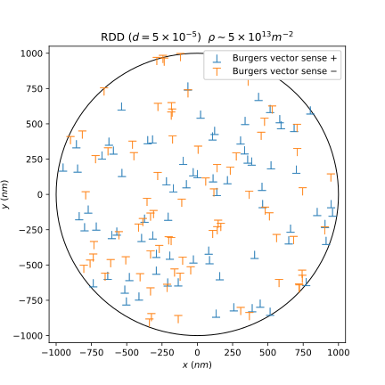
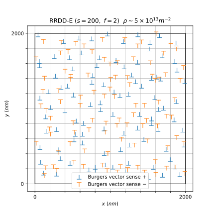
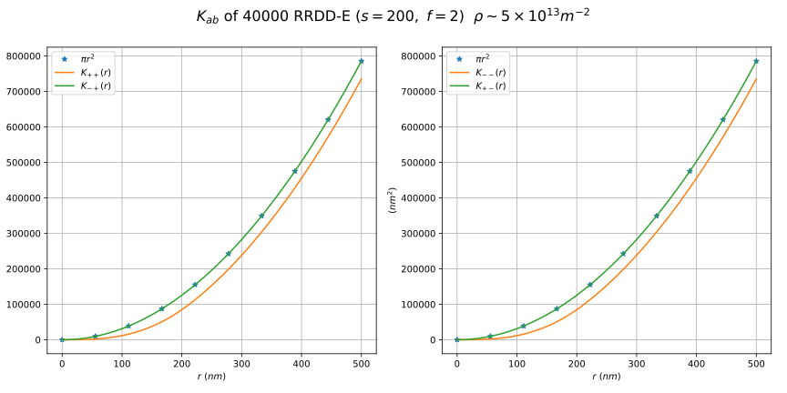
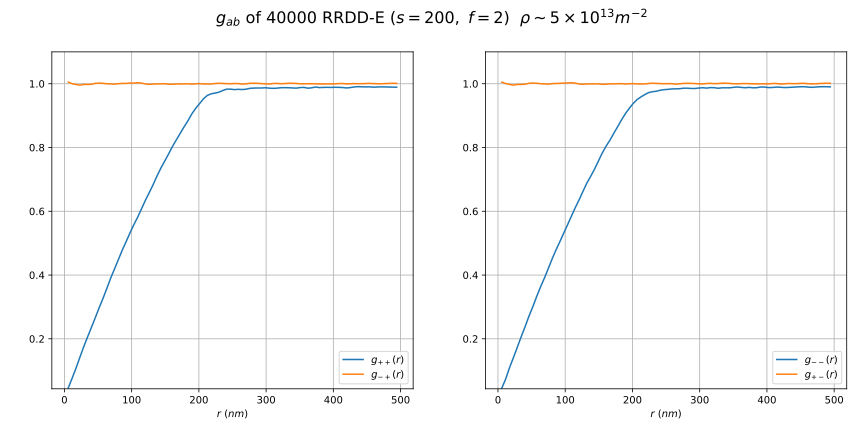
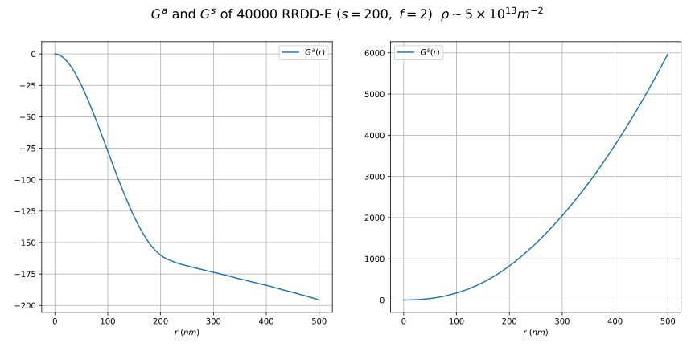

<div align="center">
  
</div>

# Line Profile Analysis - Input

This repository is related to the analysis of crystals containing dislocations by X-ray diffraction. It is part of a project conducted during a research internship at the laboratory of material and structural sciences of the *École Nationale Supérieure des Mines de Saint-Étienne*. Three python packages have been developed to conduct line profile analyses based on simulation results:
* [`lpa.input`](https://github.com/DunstanBecht/lpa-input) (line profile analysis input generator)
* [`lpa.xrd`](https://github.com/DunstanBecht/lpa-xrd) (line profile analysis x-ray diffraction simulation program)
* [`lpa.output`](https://github.com/DunstanBecht/lpa-output) (line profile analysis output analyzer)

# Features

The package `lpa.input` can be used to:
* generate dislocation distributions according to different models
* export the distributions in standardized files for input to an X-ray diffraction simulation program
* export the distributions in dislocation maps
* export a spatial analysis of the distributions

# Installation

The package is indexed on [PyPI](https://pypi.org/project/lpa-input/) and installable directly via pip:
```bash
pip install -U lpa-input
```

# Examples

### Distribution maps
<div align="center">


</div>

### Input data files
```bash
# please keep the structure of this file unchanged
 1  1  0 # z: direction of 'l' (line vector) [uvw]
-1  1  0 # x: direction of 'L' (Fourier variable) [uvw]
 1  1  0 # b: Burgers vector direction [uvw]
 2  0  0 # g: diffraction vector direction (hkl)
0.250000 # C: contrast coefficient [1]
0.404940 # a: cell parameter [nm]
      50 # s: Cylinder radius [nm]
     2.6 # a3: step size of 'L' along x [nm]
   0.345 # nu: Poisson's number [1]
      16 # number of dislocations
# Burgers vector and dislocation (x,y) coordinates
 1  1.13058137427338092351E+01 -4.76600232529834855200E+01
 1 -7.24634689401348541793E+00 -3.36789036259036222987E+01
 1  4.11971770783698545415E+01  1.97465636113370450744E+01
 1  1.40300831051175638464E+01 -5.05846035346056321913E-01
-1  6.04497556380058576053E+00  1.08883960386682971944E+01
-1 -3.56144577559420838497E+01  2.59934318627030158666E+01
-1  1.54036860797628740727E+01  3.21880761359844447256E+00
-1 -4.36699650001685313327E+01  1.60868469539326213180E+01
-1  1.17803289708455576346E+01 -4.96603575341169829471E+01
-1 -1.52647469191448177384E+01 -7.09460846800485569474E+01
-1  4.93465844192345883812E+01  2.36527242238702122279E+01
-1  1.77957208333133877431E+02 -6.41613792463802035115E+00
 1  9.74374358415108616782E+01  1.75507308381520175544E+02
 1 -4.57993525636381448862E+01  3.34269402155986767866E+01
 1  1.55508426276012443168E+02  3.24955795569969723147E+01
 1 -5.04073629684087691771E+01  1.85687241430349949667E+01
```

### Spatial analysis




# Physical aspects

Two geometries are proposed:
* circle (intersection of a plane with a cylinder) centered in `(0, 0)`
* square (intersection of a plane with a cuboid) bottom left corner at `(0, 0)`

A dislocation associates:
* a Burgers vector sense `b`
* a position `p`

A distribution is mainly characterized by the following elements:
* the shape of the region of interest
* the model used for the random generation of dislocations
* the generated dislocations

A sample is a set of distribution and is mainly characterized by:
* the number of generated distribution stored
* the shape of the region of interest
* the model used for the random generation of dislocations
* the stored distributions

# Abbreviations

Some abbreviations are used in the program:

### Models
* `RDD` random dislocation distribution
* `RRDD` restrictedly random dislocation distribution
* `RCDD` random cell dislocation distribution

### Model variants
* `R` randomly distributed Burgers vectors
* `E` evenly distributed Burgers vectors
* `D` dipolar Burgers vectors

### Boundary conditions
* `PBCG` periodic boundary conditions applied when generating the distribution
* `PBCR` periodic boundary conditions applied when running the simulation
* `IDBC` image dislocations boundary conditions

# User guide

The directory `tests/` contains several examples of package module usage. The docstrings are carefully written and it is recommended to refer to the documentation with the `help()` command.
